# At Home Quantum Entanglement Demo

This repository features documentation, code, and instructions to perform an at-home demonstration of [quantum entanglement](https://en.wikipedia.org/wiki/Quantum_entanglement). It works by detecting statistical anti-correlations in the [Compton scattering](https://en.wikipedia.org/wiki/Compton_scattering) of high-energy entangled photons produced fro an electron positron matter-antimatter [annihilation](https://en.wikipedia.org/wiki/Annihilation) event.

This experimental design is based on an experiment performed and described by [George Musser](https://en.wikipedia.org/wiki/George_Musser) on his [blog](https://www.criticalopalescence.com/p/how-to-build-your-own-quantum-entanglement-experiment-part-1-of-2) and as featured in a 2013 [article](https://www.scientificamerican.com/blog/critical-opalescence/how-to-build-your-own-quantum-entanglement-experiment-part-1-of-2/) in [Scientific American](https://www.scientificamerican.com/).

This experiment has been updated to take advantage of more recent tools and technology:
* It uses two [MightyOhm](https://mightyohm.com/blog/) [Geiger Counter Kit](https://mightyohm.com/blog/products/geiger-counter/) which enable easy wiring to an [Arduino](https://www.arduino.cc/) microcontroller.
* It uses an Arduino-based ESP32 with headers, which enables easy wiring to the Geiger counters for coincident detection, as well as data logging by connecting to a computer over USB.
* It uses LEGO-compatible blocks to make the positioning of detectors, the positron source, and aluminum scattering blocks both flexible and repeatable.

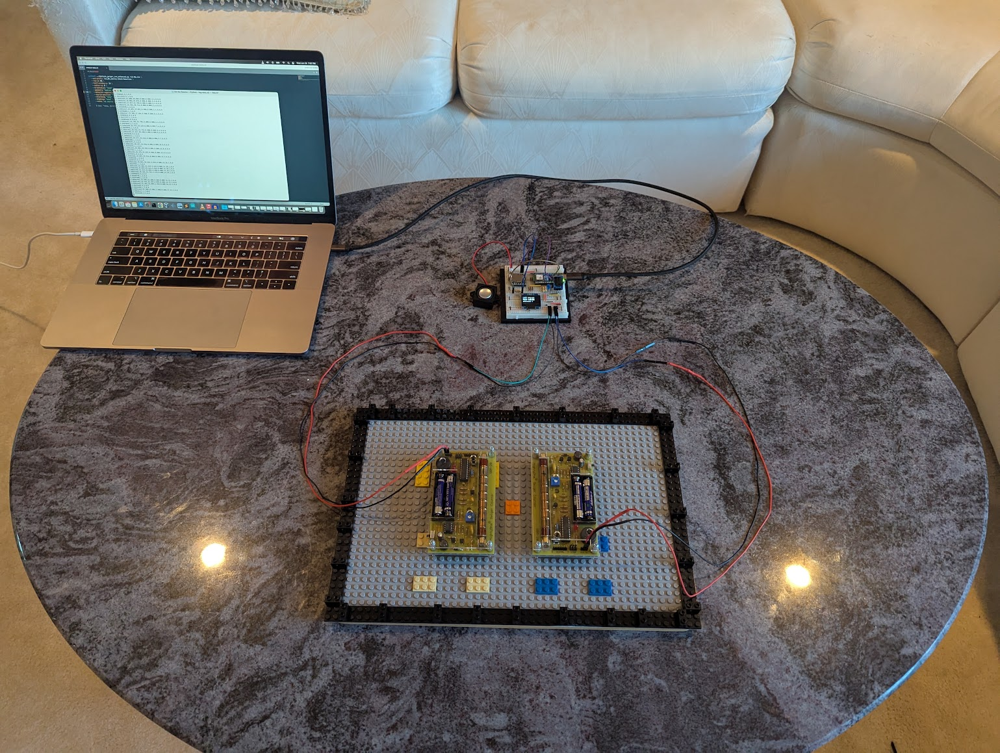

Above is an image of the assembled kits, both wired into an Arduino, and connected to a computer via USB for logging and analysis. 

### Other Demonstrated Science 

Aside from demonstrating Quantum Entanglement (recognized in the [2022 Nobel Prize in Physics](https://www.nobelprize.org/prizes/physics/2022/press-release/), this experiment also demonstrates a number of other outstanding breakthroughs in 20th century science:

- [Ernest Rutherford's](https://en.wikipedia.org/wiki/Ernest_Rutherford) discovery of the [radioactive transformation of elements](https://en.wikipedia.org/wiki/Nuclear_transmutation) earning him the [1908 Nobel Prize in Chemistry](https://www.nobelprize.org/prizes/chemistry/1908/summary/) as this experiment involves the radioactive transformation of [Sodium](https://en.wikipedia.org/wiki/Sodium) metal into [Neon](https://en.wikipedia.org/wiki/Neon) gas.
- [Arthur Compton's](https://en.wikipedia.org/wiki/Arthur_Compton) discovery of [Compton scattering](https://en.wikipedia.org/wiki/Compton_scattering) winning him the [1927 Nobel Prize in Physics](https://www.nobelprize.org/prizes/physics/1927/summary/) as this experiment directly relies on Compton Scattering gamma rays off of Aluminum blocks.
- [Albert Einstein's](https://en.wikipedia.org/wiki/Albert_Einstein) proof that light is made of photons, through his analysis of the [photoelectric effect](https://en.wikipedia.org/wiki/Photoelectric_effect), earning him the [1921 Nobel Prize in Physics](https://www.nobelprize.org/prizes/physics/1921/summary/) as this experiment's Geiger-Müller tube can only detects photons carrying enough energy to dislodge electrons from the tube's wall.
- [Paul Dirac's](https://en.wikipedia.org/wiki/Paul_Dirac) prediction of, and [Carl Anderson's](https://en.wikipedia.org/wiki/Carl_David_Anderson) later experimental discovery of [antimatter](https://en.wikipedia.org/wiki/Antimatter) and in particular, [positrons](https://en.wikipedia.org/wiki/Positron) earning Dirac and Anderson the [1933](https://www.nobelprize.org/prizes/physics/1933/summary/) and [1936 Nobel Prizes in Physics](https://www.nobelprize.org/prizes/physics/1936/summary/), respectively. This experiment uses positrons, and their antimatter annihilation to create an entangled photon pair. Incidentally this also demonstrates Einstein's [mass-energy equivalence](https://en.wikipedia.org/wiki/Mass%E2%80%93energy_equivalence) (E = mc<sup>2</sup>) as the energy of the gamma rays equals the rest-mass of the electron and positiron (511 [keV](https://en.wikipedia.org/wiki/Electronvolt)).
- [Victor Hess's](https://en.wikipedia.org/wiki/Victor_Hess) discovery of [cosmic rays](https://en.wikipedia.org/wiki/Cosmic_ray) which earned him the [1936 Nobel Prize in Physics](https://www.nobelprize.org/prizes/physics/1936/summary/) as when these two Geiger counters are stacked vertically, it functions as a cosmic ray telescope, able to detect [muons](https://en.wikipedia.org/wiki/Muon) that travel both Geiger tubes.
- [Walther Bothe's](https://en.wikipedia.org/wiki/Walther_Bothe) invention of the [Coincidence Method](https://en.wikipedia.org/wiki/Coincidence_method) which earned him the [1954 Nobel Prize in Physics](https://www.nobelprize.org/prizes/physics/1954/summary/) as this experiment uses the simultaneous detections of two detectors to determine when that two photons result from the same radioactive decay/annihilation event. This is the basis upon which of [PET scans](https://en.wikipedia.org/wiki/Positron_emission_tomography) work.

## Parts List

In total, the experiment can be put together for a total cost of around 500 USD (pricing information as of mid 2026).

Here is a link to the [parts list](related-docs/Entanglement-Demo-Shopping-List.pdf).

Note: If one already has the equipment for soldering it can be done for much less.

### Assembling the Geiger Counters

This experiment uses a kit to make each of the two Geiger counters. This requires some soldering. The kits arrive with the following parts:

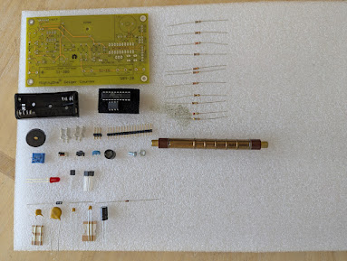

After soldering and attaching some screws, the assembled Geiger counters look like this:

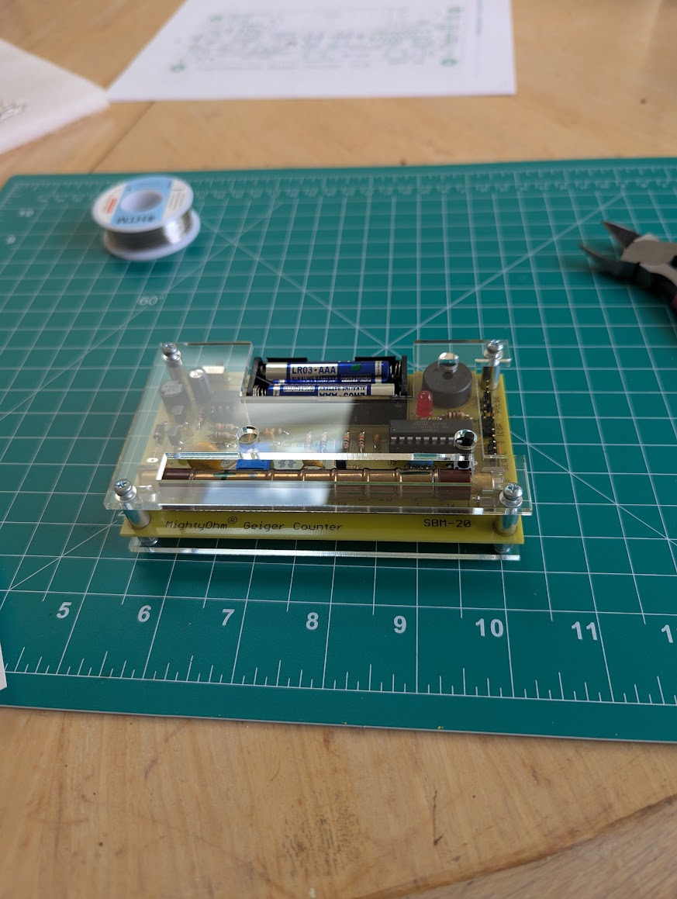

The instructions for assembling the Geiger Counter kits can be found at [this link](related-docs/MightyOhm-Geiger-Counter-Assembly-Instructions.pdf).

Conveniently, each Geiger Counter has [pin headers](https://en.wikipedia.org/wiki/Pin_header) which send a 100 microsecond pulse which can be interpreted by an Arduino device with headers. Using a [breadboard](https://en.wikipedia.org/wiki/Breadboard) together with and male-to-female [jumper wires](https://en.wikipedia.org/wiki/Jump_wire), the Geiger counters can be directly wired to the Arduino device without soldering.

### Testing the Geiger Counters

The Geiger counters are sensitive to beta and gamma radiation, and any significant source of these can trigger the counter. The counters will also detect background radiation at a level of around 20 counts per minute at sea level. By arranging the detectors vertically, simultaneous detections will trigger several times a minute due to [cosmic-ray-generated](https://en.wikipedia.org/wiki/Cosmic_ray) [muons](https://en.wikipedia.org/wiki/Muon) passing from the upper atmosphere down to earth and passing through both detectors.

Below is a link to a video demonstrating testing of the two detectors with a 1 μCi test source of Na-22. A source of positrons, such as Na-22, is required in order to perform some of the entangled photon pair experiments detailed later in this document. Check all applicable laws in your area and familiarize yourself with safe practices before obtaining, handling, or disposing of any radioactive sources. 

[](https://www.youtube.com/watch?v=xobj9LGZI20)

## Programming the Microcontroller

Before the Arduino device will work as intended for this project, it must be loaded with software. To do this, you must have the Arduino IDE installed.

You may download the Arduino IDE for your operating system from [this link](https://www.arduino.cc/en/software/).

Once it is installed, connect the Arduino device to your computer via a USB-C cable, make sure the cable supports data (sone USB cables are for power only).

Then open the Arduino IDE by opening the micro-controller source code (known as a [sketch](https://en.wikipedia.org/wiki/Arduino#Sketch)) located in the [microcontroller-code](microcontroller-code) directory.

Then select the board from the drop down list at the top of the interface:

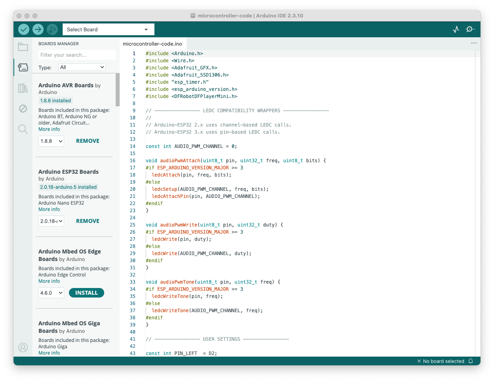

### Adding Library Dependencies

Before you can compile the sketch you must add the appropriate library dependencies. To do this, click on the icon that looks like a set of books on the left hand side of the IDE, to make the `Library Manager` appear, then in the search box, search for, and then add, each of the following libraries:

1. Adafruit BusIO
2. Adafruit GFX Library
3. Adafruit SSD1306
4. DFRobotDFPlayerMini

### Compiling and Uploading the Code

Once each of the library dependencies have been added, you can compile and upload the code to the Arduino device. To do this, click the icon at the top left which looks like a right-ward facing arrow. Note that it may take a few minutes to compile and transfer the code. Once it does, you will see lights flicker on the Arduino device and then it should simply show a solid blue LED light up. This indicates the sketch has been successfully compiled and transferred to the device and it is now running.

## Wiring the Breadboard

The following represents the pin diagram for the Nano ESP32 with headers:

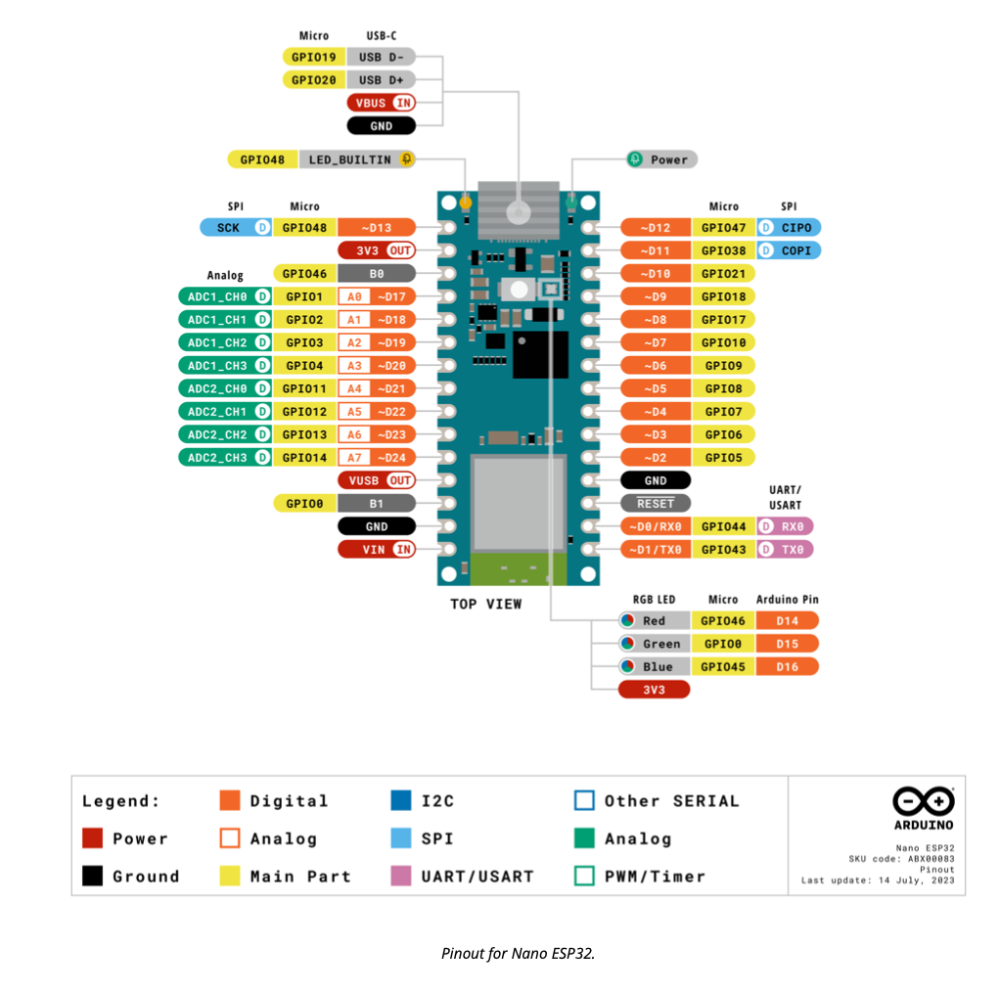

To wire the ESP32 to the two Geiger counters, a LED, a buzzer, and an optional speaker output, connect the wires to the pins as shown below:

```

                                 Arduino Nano ESP32
                                     TOP VIEW

                    USB-C connection to Computer or Power Supply
                                        ↑
       
                       LEFT HEADER          RIGHT HEADER
                       ───────────          ────────────
                       D13                  D12
OLED, buzzer VCCs →    3V3                  D11
                       B0                   D10
                       A0                   D9
                       A1                   D8
                       A2                   D7
                       A3                   D6        ← buzzer signal
         OLED SDA →    A4 / SDA             D5        ← 330 Ω → LED anode
         OLED SCL →    A5 / SCL             D4
                       A6                   D3        ← 1 kΩ → Geiger RIGHT J6 pulse
                       A7                   D2        ← 1 kΩ → Geiger LEFT J6 pulse
                       VUSB                 GND       ← Geiger GNDs, LED cathode, buzzer GND
                       B1                   RESET
         OLED GND →    GND                  D0 / RX0
                       VIN                  D1 / TX0


```

The end result should look something like the following when all wired up:

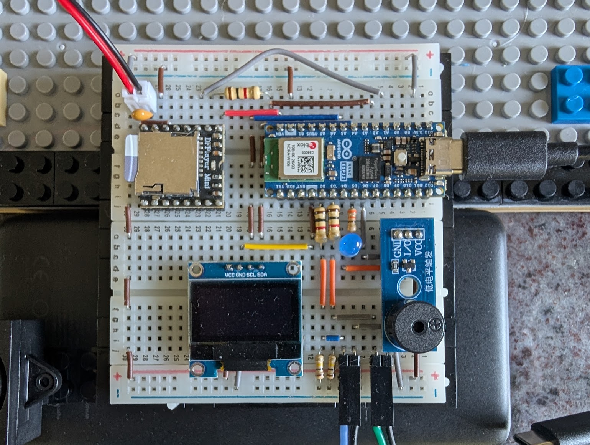

Note when connecting the pulse wires to the Geiger counter kit, the MightyOhm Geiger Counter has a section labeled J6 Pulse, with 3 pins Left to Right:

| Pin 1     | Pin 2       | Pin 3        |
| :-------- | :---------- | :----------- | 
| VCC       | PULSE       |  GND         |

Note: `Pin 1` is marked with a small white triangle. `Pin 1` is not used and not connected to the ESP32.

Only `Pin 2` and `Pin 3` on each Geiger Counter needs to connect to the breadboard. `Pin 2` on the Left Geiger counter should connect to `D2` while `Pin 2` on the Right Geiger Counter should connect to `D3`. The grounds (`Pin 3`) on each Geiger counter should connect to `GND` on the ESP32. Ideally, there should be a 100 kΩ [pull-down resistor](https://en.wiktionary.org/wiki/pull-down_resistor) between the Pulse lines `D2` and `D3` and `GND`. This will increase the stability of the signal and prevent false positives due to loose wires, static build up, or the wires picking up signals acting as antennae.

To verify operation, you can test with either a positron source placed between the detectors as shown in this video:

[](https://www.youtube.com/watch?v=ERMolkiLw2E)

After everything is wired:
1. Power on both MightOhm GeigerCounters by flipping the power switch
2. Connect USB power to the Arduino board from a Computer using a USB-C data cable
3. Start python logger to read data over USB

You should see events on the screen each time either Geiger flashes.

Or alternatively, you can stack the detectors one on top of the other, as is shown here:

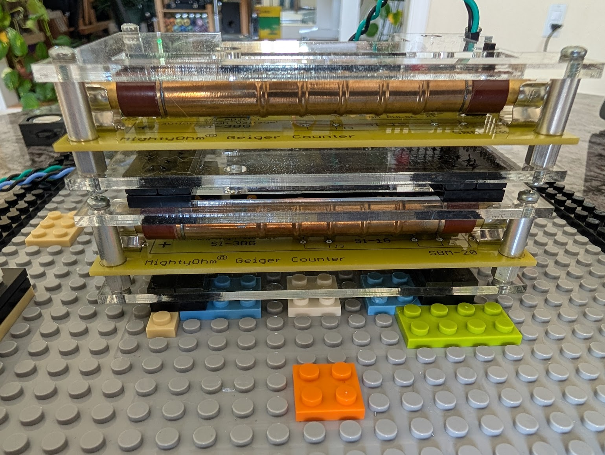

And wait for a cosmic ray muon to trigger simultaneous detection. A simultaneous detection event should trigger a flash and beep, as well as the OLED display to update the count of the number of simultaneous detections.

### Setting up DFRobot DFPlayer Mini

For playback of an arbitrary sound file as an audio alert upon detection of a photon pair, the following:

#### Load MP3 File

First, obtain a microSD card and make sure it is formatted with the [FAT32 filesystem](https://en.wikipedia.org/wiki/File_Allocation_Table#FAT32). If it is not already formatted with this file system, you will need to reformat it. The size should be 16 GB or less.

Add the desired MP3 file to be played to the following path on that microSD card: `/MP3/0001.mp3`

That is, first create a directory named `MP3` at the root level of the microSD card's filesystem, then place the MP3 file in that directory, and rename it to `0001.mp3`. This file will then play at the moment of any simultaneous detection by the Geiger counters.

#### Connecting the ESP32 to the DFPlayer

All wiring between the ESP32 and the DFPlayer is done on the left-side of the DFPlayer:

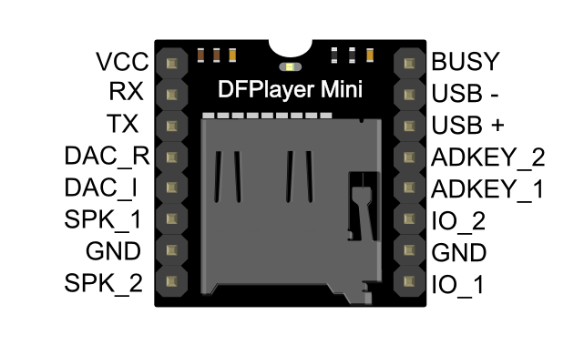

Connect via jumper wires the following four pins from the EST32 to the DFPlayer:

```
Nano ESP32 5V/VBUS/VIN-side  → DFPlayer VCC
Nano ESP32 GND               → DFPlayer GND
Nano ESP32 A2 pin            → 1 kΩ resistor → DFPlayer RX
Nano ESP32 A1 pin            → DFPlayer TX
```

In the end, the DFPlayer Mini should appear like this:

```
                                       DFPlayer Mini
                                         TOP VIEW

           
                           LEFT HEADER                    RIGHT HEADER
                           ───────────                    ────────────
                ESP VIN →  VCC                            BUSY
 ESP A2 → 1 kΩ resistor →  RX                             USB-
                 ESP A1 →  TX                             USB+
                           DAC_R                          ADKEY_2
                           DAC_I                          ADKEY_1
     speaker terminal 1 →  SPK_1  ←|                      IO_2
                ESP GND →  GND     | 0.1 µF capacitor     GND
     speaker terminal 2 →  SPK_2  ←|                      IO_1
```

Note: The 0.1 µF ceramic across the speaker pins is optional but can help reduce high frequency noise.

#### Wire the DFPlayer to the Speaker

Note that polarity to the speaker terminals does not matter.

```
DFPlayer SPK_1           → speaker terminal 1
DFPlayer SPK_2           → speaker terminal 2
```

The speakers should be 3 Watt, 8 Ohm speakers. Note that `JST-PH 2.0mm 2 Pin Male Connectors` may simplify the connection of speakers to a breadboard, especially if the speakers come with `JST-PH 2.0` connectors.

Once the speakers are wired correctly to the DFPlayer, you can verify that the MP3 file plays correctly upon a coincidence detection, as shown in this video:

[](https://www.youtube.com/watch?v=wpQJMHlid0s)

## Collecting and Analyzing Data

This project comes with scripts to collect and analyze data, and even comes with a number of pre-set experiments to peform. These scripts, and experiments, can be found in the [experiments](experiments) directory. The two scripts are:

```
log_geiger.py
analyze_geiger_run.py
```

These are [python](https://en.wikipedia.org/wiki/Python_(programming_language)) scripts and require `python3` in order to run.

## Collecting Data

When the Arduino device is connected to a computer via USB, the `log_geiger` script will connect to it and start outputting data to the screen. Each time either the left or right detector registers a detection event, it will output which detector sent the signal, and a microsecond-accurate timestamp of when it occurred. Periodically, the script will also report summary data.

The detection event lines are prefaced with `E` while the summary report lines are prefaced with `S`:

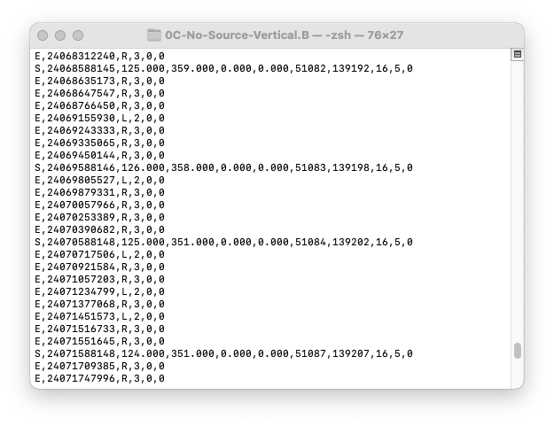

When you have collected sufficient data, you can end the logging script by sending an exit command (generally `Ctrl+C` on most systems).

Note that running this script requires specification of the USB port to which the Arduino device is attached, this can vary from system to system, below are some examples:

### Windows Devices

```bash
# Windows
python3 log_geiger.py --port COM5 --out --out output_file.csv
```

### Linux Devices

```bash
# Linux
python3 log_geiger.py --port /dev/ttyACM0 --out --out output_file.csv
```

### MacOS Devices
```bash
# macOS
python3 log_geiger.py --port /dev/cu.usbmodem206EF13166CC2 --out output_file.csv
```

Note that the particular USB device name will change from system to system. The Arduino IDE displays the exact device name to use for logging.

### Analyzing Data

After collecting data and storing it to an output file, for example `output_file.csv` the analyze script can be run to report various statistics:


```bash
python3 analyze_geiger_run.py output_file.csv \
  --out-prefix run_perpendicular_geometry \
  --run-id R1 \
  --half-window-us 3 \
  --center-us 0 \
  --orientation perpendicular \
  --geometry "Al blocks, 90-degree scatter" \
  --detector-separation "100mm" \
  --source-position "centered" \
  --shielding "none" \
  --aluminum "present" \
  --notes "overnight run, no bumps observed"
```

This will result in the following output to the screen:

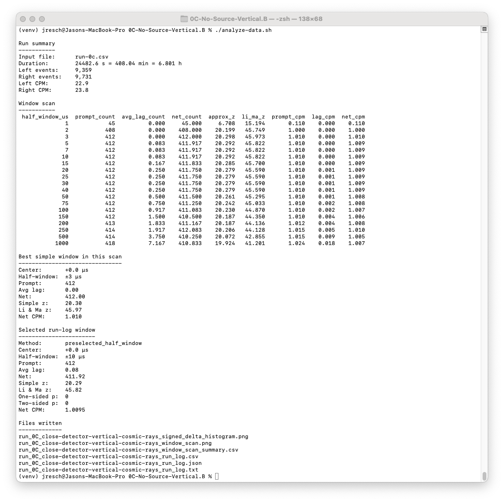

The output information includes the run duration, total number of left and right events, as well as counts per minute for both detectors. It then reports, for various time windows ranging from 1 microsecond to 1000 microseconds, how many coincident events were observed within each of those windows. Generally 3 microseconds is the most robust, as it is narrow enough to register all genuine coincidences, without being so wide that it includes spurious events that occur near the same time but are not genuinely correlated.

The rate of these spurious events are continuously estimated by looking for coincident events if the right or left detector's reported events are time-shifted by a significant period (say half a second). These are reported as `lag counts` and should be subtracted from the raw observed counts to yield a more accurate net count.

In addition, it will also generate the following files:

```
<out-prefix>_signed_delta_histogram.png
<out-prefix>_window_scan.png
<out-prefix>_window_scan_summary.csv
<out-prefix>_run_log.csv
<out-prefix>_run_log.json
<out-prefix>_run_log.txt
```

Where `<out-prefix>` was the parameter supplied to the script under `--out-prefix`.

Here is an example of a generated histogram. It shows a genuine signal within the ±5 microseconds bucket, indicating a true excess of correlated events not observed for any of the other greater time-difference buckets:

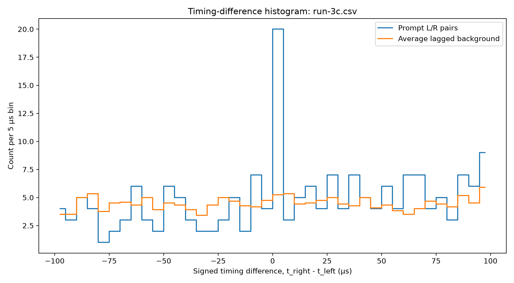


## Experimental Configurations

The minimum experiments required to demonstrate quantum entanglement are defined below. Note that for each of these experiments, a sub-directory has already been setup within the [experiments](experiments) directory, which contains a [bash](https://en.wikipedia.org/wiki/Bash_(Unix_shell)) script to log and analyze data for that run.

### Phase 0: Validation

Phase 0 tests are meant to validate the equipment, establish a baseline for environmental background radiation, and verify detection of coincidences. These tests are not strictly required to prove quantum entanglement, but are important to run before proceeding to ensure the equipment is working as expected.

- **0A: Detectors close, no source present** (estimate background radiation, validate equipment and electronics working)
- **0B: Detectors horizontally separated, no source present** (expect lower cosmic ray coincident effect)
- **0C: Detectors vertically stacked, no source present** (expect high cosmic ray coincidences, crude cosmic ray telescope)

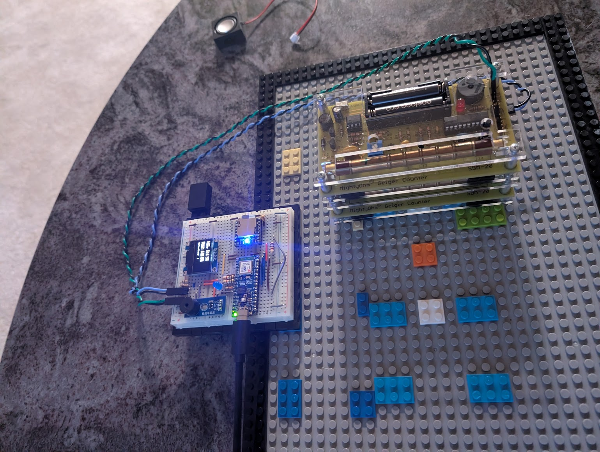

The expected results are that general CPM rates should be more or less consistent regardless of placement, but that coincident event detection rates should drop when the detectors are separated by a larger horizontal difference in test `0B` and should sharply increase when the detectors are stacked vertically in `0C`.

### Phase 1: Annihilation Pair Detection

The next phase is meant to demonstrate that entangled photon pairs are emitted in directions that are 180° off from one another, heading in opposite directions along the same axis.

- **1A: Detectors in demonstration position, no source** (establish baseline environmental background radiation and coincidences)
- **1B: Positron source is added centered and inline with axis between the detectors** (measure increase in singles counts and coincidences)
- **1C: Positron source is moved off-axis from the line between the detectors** (expect small drop in singles detections, but large drop in coincidences)

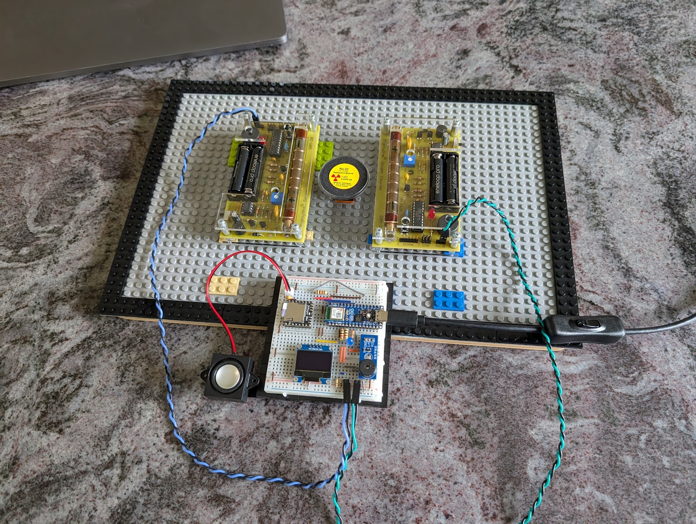

The expected result is that coincident detections sharply increase from `1A` to `1B` when the positron source is placed exactly between the two directors, but that the coincident rate drops when the source is raised relative to the detectors (taking it off-axis) and making it unlikely for two entangled photons traveling in opposite directions to reach both detectors.

### Phase 2: Compton Polarimetry in Parallel Configuration

This phase along with the next is where properties of entangled photons are measured. It uses a technique known as Compton Polarimetry. Because the polarizations of the entangled photons are perpendicular to one another (offset by 90° relative to the other) when one of these photons scatters, its preferred scattering angle will be along a plane that is perpendicular to the preferred scattering angle of its entangled partner photon.

By placing aluminum blocks in the path of the photons, and placing detectors in either the same plane (parallel) or in a perpendicular plane (perpendicular) we can expect to observe different rates of coincident detections.

- **2A: Detectors in Parallel Geometry Positions, no source present** (establish baseline background radiation)
- **2B: Detectors in Parallel Geometry Positions, source present without aluminum blocks** (establish baseline coincidences without effect of scattered photons)
- **2C: Detectors in Parallel Geometry Positions, source present with aluminum blocks** (establish additional coincidences from scattered photons in parallel case)

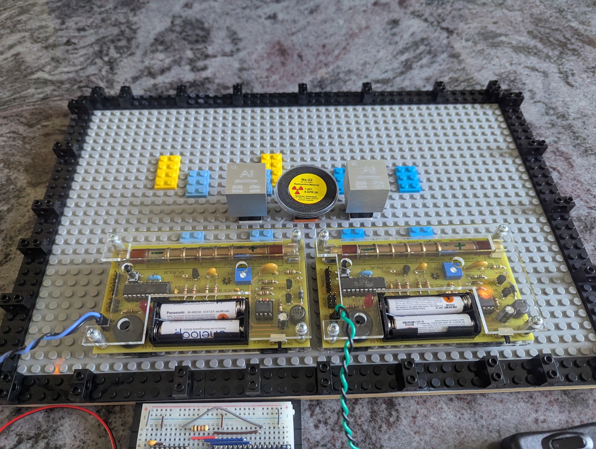

The rate of coincident detections for the parallel case is expected by theory to be lower by an amount of roughly 2.6× compared to the perpendicular orientation of the detectors.

### Phase 3: Compton Polarimetry in Perpendicular Configuration

In this phase, we establish baseline background levels with and without the positron source, and detection rates with and without the presence of the aluminum blocks. But unlike Phase 2, in this case the detectors are placed in planes that are perpendicular to each other. This maximizes the rate of detection of coincidences for entangled photon pairs that are scattered by interacting with electrons in the aluminum blocks.

- **3A: Detectors in Perpendicular Geometry Positions, no source present** (establish baseline background radiation)
- **3B: Detectors in Perpendicular Geometry Positions, source present without aluminum blocks** (establish baseline coincidences without effect of scattered photons)
- **3C: Detectors in Perpendicular Geometry Positions, source present with aluminum blocks** (establish additional coincidences from scattered photons in perpendicular case)

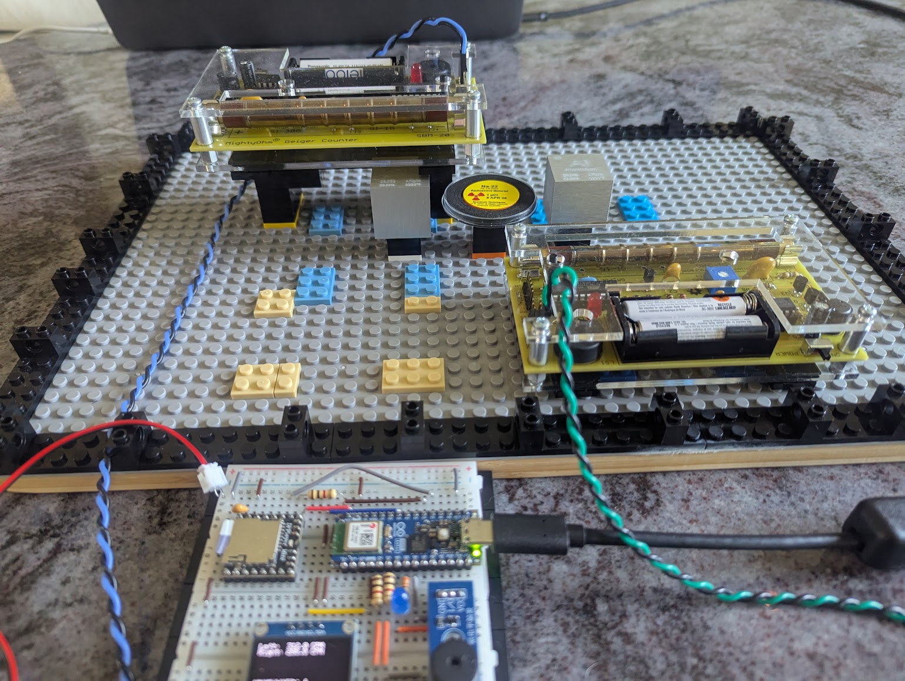

We expect that after accounting for and subtracting background events, and detection levels without the aluminum blocks present, that the observed number of detections in experiment 3C will be 2.6× greater than was observed in experiment 2C after similarly subtracting out background events.

## Results

The following section presents a summary of experimental data from the phase 2 and phase 3 runs, and concludes with evidence of entanglement. Together these represent over 75 hours of data collection, resulted in over 200 megabytes worth of data.

### Phase 2: Parallel Experiments

The following are data from parallel geometry runs.

#### 2A: Parallel, No Source

```
Run summary
-----------
Input file:      2A.csv
Duration:        36624.2 s = 610.40 min = 10.173 h
Left events:     14,644
Right events:    14,885
Left CPM:        24.0
Right CPM:       24.4

Window scan
-----------
 half_window_us  prompt_count  avg_lag_count  net_count  approx_z  li_ma_z  prompt_cpm  lag_cpm  net_cpm
              1             0          0.000      0.000       NaN    0.000       0.000    0.000    0.000
              2             2          0.000      2.000     1.414    3.203       0.003    0.000    0.003
              3             2          0.000      2.000     1.414    3.203       0.003    0.000    0.003
              5             2          0.000      2.000     1.414    3.203       0.003    0.000    0.003
              7             2          0.000      2.000     1.414    3.203       0.003    0.000    0.003
             10             2          0.000      2.000     1.414    3.203       0.003    0.000    0.003
```

#### 2B: Parallel, No Blocks

```
Run summary
-----------
Input file:      2B.csv
Duration:        44309.5 s = 738.49 min = 12.308 h
Left events:     198,362
Right events:    204,420
Left CPM:        268.6
Right CPM:       276.8

Window scan
-----------
 half_window_us  prompt_count  avg_lag_count  net_count  approx_z  li_ma_z  prompt_cpm  lag_cpm  net_cpm
              1             2          2.833     -0.833    -0.379   -0.504       0.003    0.004   -0.001
              2            17          4.750     12.250     2.627    4.070       0.023    0.006    0.017
              3            19          6.083     12.917     2.579    3.930       0.026    0.008    0.017
              5            24         10.000     14.000     2.401    3.545       0.032    0.014    0.019
              7            28         14.167     13.833     2.130    3.078       0.038    0.019    0.019
             10            36         19.250     16.750     2.253    3.237       0.049    0.026    0.023
```

#### 2C: Parallel

```
Run summary
-----------
Input file:      2C.csv
Duration:        41085.5 s = 684.76 min = 11.413 h
Left events:     193,788
Right events:    200,681
Left CPM:        283.0
Right CPM:       293.1

Window scan
-----------
 half_window_us  prompt_count  avg_lag_count  net_count  approx_z  li_ma_z  prompt_cpm  lag_cpm  net_cpm
              1             1          3.250     -2.250    -1.091   -1.422       0.001    0.005   -0.003
              2            21          5.167     15.833     3.095    4.874       0.031    0.008    0.023
              3            23          6.500     16.500     3.038    4.701       0.034    0.009    0.024
              5            24         10.000     14.000     2.401    3.545       0.035    0.015    0.020
              7            30         13.667     16.333     2.472    3.612       0.044    0.020    0.024
             10            34         20.500     13.500     1.829    2.594       0.050    0.030    0.020
```

### Phase 3: Perpendicular Experiments

The following are data from perpendicular geometry runs.

#### 3A: Perpendicular, No Source

```
Run summary
-----------
Input file:      3A.csv
Duration:        35696.6 s = 594.94 min = 9.916 h
Left events:     14,063
Right events:    14,151
Left CPM:        23.6
Right CPM:       23.8

Window scan
-----------
 half_window_us  prompt_count  avg_lag_count  net_count  approx_z  li_ma_z  prompt_cpm  lag_cpm  net_cpm
              1             0          0.000      0.000       NaN    0.000       0.000    0.000    0.000
              2             5          0.000      5.000     2.236    5.065       0.008    0.000    0.008
              3             5          0.000      5.000     2.236    5.065       0.008    0.000    0.008
              5             5          0.083      4.917     2.181    4.517       0.008    0.000    0.008
              7             5          0.083      4.917     2.181    4.517       0.008    0.000    0.008
             10             5          0.167      4.833     2.126    4.195       0.008    0.000    0.008
```

#### 3B: Perpendicular, No Blocks

```
Run summary
-----------
Input file:      3B.csv
Duration:        39149.7 s = 652.49 min = 10.875 h
Left events:     193,816
Right events:    183,066
Left CPM:        297.0
Right CPM:       280.6

Window scan
-----------
 half_window_us  prompt_count  avg_lag_count  net_count  approx_z  li_ma_z  prompt_cpm  lag_cpm  net_cpm
              1             1          3.250     -2.250    -1.091   -1.422       0.002    0.005   -0.003
              2            19          4.833     14.167     2.902    4.551       0.029    0.007    0.022
              3            23          7.333     15.667     2.845    4.336       0.035    0.011    0.024
              5            26         11.083     14.917     2.450    3.607       0.040    0.017    0.023
              7            29         14.417     14.583     2.213    3.204       0.044    0.022    0.022
             10            36         20.083     15.917     2.125    3.039       0.055    0.031    0.024
```

#### 3C: Perpendicular

```
Run summary
-----------
Input file:      3C.csv
Duration:        45934.5 s = 765.57 min = 12.760 h
Left events:     231,635
Right events:    226,705
Left CPM:        302.6
Right CPM:       296.1

Window scan
-----------
 half_window_us  prompt_count  avg_lag_count  net_count  approx_z  li_ma_z  prompt_cpm  lag_cpm  net_cpm
              1             2          3.333     -1.333    -0.577   -0.763       0.003    0.004   -0.002
              2            35          6.000     29.000     4.529    7.470       0.046    0.008    0.038
              3            37          8.083     28.917     4.307    6.886       0.048    0.011    0.038
              5            42         12.833     29.167     3.939    6.036       0.055    0.017    0.038
              7            46         17.083     28.917     3.641    5.448       0.060    0.022    0.038
             10            54         23.417     30.583     3.476    5.108       0.071    0.031    0.040
```

### Evidence of Entanglement

Let us review a summary of the data to determine if we have witnessed any evidence of quantum entanglement in the simultaneously detected photon pairs.

### Results Summary Table

Taking the 2 microsecond time window from each of the above, we observe the following rates in terms of events per hour:

| Run                            | Runtime (Hours) | Net Events (at 2µs) | Events/hr  |
| :----------------------------- | --------------: | ------------------: | ---------: |
| 2A - Parallel No Source        |  10.173         |  2.000              |   0.197    |
| 2B - Parallel No Blocks        |  12.308         | 12.250              |   0.995    |
| 2C - Parallel                  |  11.413         | 15.833              |   1.387    |
| 3A - Perpendicular No Source   |   9.916         |  5.000              |   0.504    |
| 3B - Perpendicular No Blocks   |  10.875         | 14.167              |   1.303    |
| 3C - Perpendicular             |  12.760         | 29.000              |   2.273    |

### Comparison to Theoretical Expectations

A few things stand out from this. Despite both geometries having similar Right and Left CPMs (around 300), the `No Source` perpendicular has a significantly higher background coincidence rate (0.504 vs. 0.197 events per hour). This may be due to the fact that the elevated position of one of the detectors made it more sensitive to cosmic rays.

As expected for both geometries, the addition of the aluminum blocks increased the rate of coincident detections:
- The Perpendicular Geometry (3C) 1.768 events/hr > The Perpendicular Geometry without Blocks (3B) 1.303/hr
- The Parallel Geometry (2C) 1.387 events/hr > The Parallel Geometry without Blocks (2B) 0.995/hr

This indicates that the aluminum blocks, when present, are scattering the photons towards the detectors.

Also as we would expect, the addition of aluminum blocks in the perpendicular geometry has a greater net effect increase, than it does in the parallel geometry:

- **Perpendicular:** 3B No Blocks 1.303 events/hr → 3C With Blocks 2.273 events/hr, net increase of 0.970 events/hr.
- **Parallel:** 2B No Blocks 0.995 events/hr → 2C With Blocks 1.387 events/hr, net increase of 0.392 events/hr.

These values: 0.970 events/hr and 0.392 events/hr, best reflect the raw data after subtracting out background noise of detections that come straight from the positron source without being scattered by hitting an aluminum block, and so are the most useful values for direct comparison.

We observe that for the ratio of these values, between the the perpendicular geometry (0.970) is 2.47× the value for the parallel geometry (0.392). So in other words, the effect in increasing detection events by adding the blocks is 2.47× greater for the perpendicular geometry.

Of note, this value is nearly as much as the maximum theoretical ratio as predicted by the theory, which is that the perpendicular is 2.6×. 

This bias is detection rates after Compton scattering suggests that the photons are not merely simultaneous in their detection, but are also quantum entangled, in that each photon has an (undetermined before measurement) but nevertheless a related polarization angle with its entangled twin. If these detectors were spaced at arbitrary distances (say many [light-years](https://en.wikipedia.org/wiki/Light-year)) we would still observe the same correlations, despite there being no possibility for classical influences to occur between these photons at sub-light or even at light speeds. 

So how then do the photons now how to reflect appropriately off the aluminum to preserve these correlation statistics?

